# Alur Sistem Affiliate Qutab

## Alur Lengkap: Customer & Affiliator

```mermaid
flowchart TB
    W[🏠 WEBSITE QUTAB - Halaman Utama]
    
    W --> C1 & A1

    subgraph LEFT[" "]
        direction TB
        C1[👤 CUSTOMER<br>Pilih Produk Qurban]
        C2[📝 Isi Data Diri]
        C3[💳 Pembayaran via Zendit]
        C4[✅ Pesanan Berhasil]
        C5[🎯 DASHBOARD CUSTOMER<br>Status Pesanan<br>Riwayat Qurban<br>Sertifikat]
        
        C1 --> C2
        C2 --> C3
        C3 --> C4
        C4 --> C5
    end

    subgraph RIGHT[" "]
        direction TB
        A1[🤝 AFFILIATOR<br>Klik Jadi Affiliator]
        A2[📝 Form Pendaftaran<br>Nama Email WA Alasan]
        A3[⏳ Status Menunggu]
        A4[📧 Super Admin Review]
        A5{Keputusan}
        A6[❌ DITOLAK]
        A7[✅ DISETUJUI]
        A8[🎯 DASHBOARD AFFILIATOR<br>Link Referral Unik<br>Daftar Pelanggan<br>Statistik Komisi]
        
        A1 --> A2
        A2 --> A3
        A3 --> A4
        A4 --> A5
        A5 -->|Tolak| A6
        A5 -->|Setuju| A7
        A7 --> A8
    end
    
    A8 -.->|Bagikan Link| C1
```

## Keterangan

| Peran | Dashboard | Fitur |
|-------|-----------|-------|
| **Customer** | Dashboard Customer | Status pesanan, riwayat, sertifikat |
| **Affiliator** | Dashboard Affiliator | Link referral, daftar pelanggan, komisi |
| **Super Admin** | Admin Panel | Approve/reject, kelola semua data |
