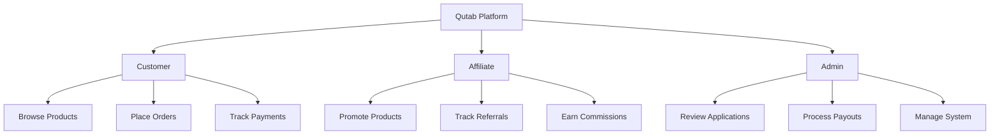

# Qutab Backend Development - Implementation Plan

## Executive Summary

This document provides a comprehensive analysis of the Qutab platform and a prioritized backend development checklist using **Django + Django REST Framework** on VPS hosting.

---

## 📊 Codebase Analysis

### System Overview

| Component | Technology | Status |
|-----------|------------|--------|
| **Frontend** | React + TypeScript + Vite + Tailwind | ✅ Complete |
| **Backend** | Django + DRF (Planned) | ❌ Not Started |
| **Database** | PostgreSQL (Planned) | ❌ Not Started |
| **Hosting** | VPS | Planned |

### Identified User Roles



---

## 🎯 Role-by-Role Feature Analysis

### ROLE 1: Customer (Pelanggan)

**Frontend Pages (7 pages):**
| Page | File | Backend Required |
|------|------|------------------|
| Landing Page | `LandingPage.tsx` | ❌ Static |
| Login/Register | `LoginPage.tsx` | ✅ Auth APIs |
| Dashboard Home | `DashboardHome.tsx` | ✅ Order summary |
| Catalogue | `Catalogue.tsx` | ✅ Product list |
| Wishlist | `Wishlist.tsx` | ✅ Wishlist CRUD |
| Payment | `Payment.tsx` | ✅ Order/Payment |
| Account Settings | `AccountSettings.tsx` | ✅ Profile CRUD |
| Help Center | `HelpCenter.tsx` | ⚠️ Mostly static |

**Backend APIs Required:**
- Authentication (register, login, logout, password reset)
- Products (list, details)
- Orders (create, list, details, tracking)
- Payments (Zendit integration, webhooks)
- Profile (get, update, change password)
- Wishlist (add, remove, list)

---

### ROLE 2: Affiliate (Affiliator)

**Frontend Pages (9 pages):**
| Page | File | Backend Required |
|------|------|------------------|
| Register | `AffiliateRegister.tsx` | ✅ Application submit |
| Login | `AffiliateLogin.tsx` | ✅ Auth APIs |
| Pending/Approved/Rejected | 3 status pages | ✅ Status check |
| Dashboard Home | `AffiliateDashboardHome.tsx` | ✅ Summary stats |
| Banner & Link | `AffiliateBannerLink.tsx` | ✅ Referral link |
| Statistik | `AffiliateStatistik.tsx` | ✅ Performance data |
| Rekening | `AffiliateRekening.tsx` | ✅ Bank account, KTP |
| Commission | `AffiliateCommission.tsx` | ✅ Balance, payouts |
| Leads | `AffiliateReferrals.tsx` | ✅ Referral list |
| Kupon | `AffiliateKuponDiskon.tsx` | ✅ Coupon list |
| Helpdesk | `AffiliateHelpdesk.tsx` | ⚠️ Mostly static |
| Profile | `AffiliateProfilePage.tsx` | ✅ Profile CRUD |

**Backend APIs Required:**
- Authentication (register, login, status check)
- Dashboard (summary stats, recent activity)
- Referral Link (generate, track clicks)
- Statistics (performance by period, charts)
- Bank Account (CRUD, KTP upload, verification)
- Commission & Payouts (balance, request, history)
- Referrals/Leads (list with filters)
- Coupons (list assigned codes)
- Profile (get, update, photo upload)

---

### ROLE 3: Admin (Administrator)

**Frontend Pages:** Not built yet ❌

**Backend APIs Required:**
- Admin authentication
- Affiliate application management (list, approve, reject)
- Payout processing (list requests, mark as paid)
- Order management (view, update status, refund)
- Coupon management (create, assign, deactivate)
- Reports & Analytics

---

## ⚠️ Critical Implementation Considerations

Based on `BACKEND_IMPLEMENTATION_NOTES.md`:

### 1. Race Condition Prevention (🔴 CRITICAL)
- Never store `balance` as a field
- Calculate dynamically from `commissions - payouts`
- Use database transactions with row locking for payouts

### 2. Performance Optimization (🟠 HIGH)
- Create `daily_stats` summary table
- Add composite indexes on high-query tables
- Query summary tables for dashboard, not raw logs

### 3. Commission Voiding (🔴 CRITICAL)
- Order cancellation must void pending commissions
- Maturation cron only processes completed orders
- Track void reason and timestamp

### 4. 30-Day Holding Period
- Commissions start as `pending`
- After 30 days + order complete → `available`
- Daily cron job for maturation

---

## 📋 Prioritized Backend Development Phases

### PHASE 1: Foundation (Week 1-2) 🔴 CRITICAL

> **Goal:** Core infrastructure and authentication for all roles

| Priority | Task | Dependency | Effort |
|----------|------|------------|--------|
| P0 | Django project setup | None | 2h |
| P0 | PostgreSQL database setup | Django | 1h |
| P0 | User model (abstract base) | Django | 2h |
| P0 | Customer authentication | User model | 4h |
| P0 | Affiliate authentication | User model | 4h |
| P0 | JWT token handling | Auth | 2h |
| P0 | CORS configuration | Django | 1h |
| P1 | Admin superuser setup | Django | 1h |

**Deliverables:**
- [ ] Django project with settings
- [ ] Custom user model with role field
- [ ] Login/Register APIs for both roles
- [ ] Application status check API
- [ ] JWT authentication working

---

### PHASE 2: Products & Orders (Week 2-3) 🔴 CRITICAL

> **Goal:** Customer can browse products and place orders

| Priority | Task | Dependency | Effort |
|----------|------|------------|--------|
| P0 | Products model | Database | 2h |
| P0 | Products API (list, detail) | Products model | 3h |
| P0 | Orders model | Products | 3h |
| P0 | Create order API | Orders model | 4h |
| P0 | Order list/detail API | Orders | 3h |
| P1 | Order tracking model | Orders | 2h |
| P1 | Wishlist model & API | Products | 3h |

**Deliverables:**
- [ ] Products CRUD in admin
- [ ] Products list/detail API
- [ ] Orders creation and listing
- [ ] Order status tracking

---

### PHASE 3: Payment Integration (Week 3-4) 🔴 CRITICAL

> **Goal:** Process payments via Zendit

| Priority | Task | Dependency | Effort |
|----------|------|------------|--------|
| P0 | Zendit API integration | Orders | 6h |
| P0 | Create payment request | Zendit | 4h |
| P0 | Payment webhook handler | Zendit | 6h |
| P0 | Order status update on payment | Webhook | 3h |
| P1 | Payment status check API | Zendit | 2h |

**Deliverables:**
- [ ] Zendit SDK integration
- [ ] Payment creation and redirect
- [ ] Webhook handling
- [ ] Auto order status update

---

### PHASE 4: Affiliate Core (Week 4-5) 🟠 HIGH

> **Goal:** Affiliate registration and referral tracking

| Priority | Task | Dependency | Effort |
|----------|------|------------|--------|
| P0 | Affiliates model | Database | 3h |
| P0 | Affiliate application API | Affiliates | 4h |
| P0 | Application status API | Affiliates | 2h |
| P0 | Referral link generation | Affiliates | 3h |
| P0 | Click tracking endpoint | Referrals | 4h |
| P0 | Click redirect handler | Click tracking | 2h |
| P1 | Referral attribution on order | Orders + Clicks | 4h |

**Deliverables:**
- [ ] Affiliate application flow
- [ ] Unique referral codes
- [ ] Click tracking
- [ ] Order attribution

---

### PHASE 5: Commission System (Week 5-6) 🔴 CRITICAL

> **Goal:** Calculate and manage commissions correctly

| Priority | Task | Dependency | Effort |
|----------|------|------------|--------|
| P0 | Commissions model | Referrals | 3h |
| P0 | Commission creation on sale | Payment webhook | 4h |
| P0 | Dynamic balance calculation | Commissions | 4h |
| P0 | Commission voiding on refund | Commissions | 3h |
| P0 | 30-day maturation cron | Commissions | 4h |
| P0 | Balance check API | Balance calc | 2h |

**Deliverables:**
- [ ] Commission records on each sale
- [ ] Dynamic balance (no stored field)
- [ ] Voiding on order cancel
- [ ] Maturation cron job

---

### PHASE 6: Payouts (Week 6-7) 🟠 HIGH

> **Goal:** Affiliates can request and receive payouts

| Priority | Task | Dependency | Effort |
|----------|------|------------|--------|
| P0 | Bank accounts model | Affiliates | 3h |
| P0 | Bank account CRUD API | Bank accounts | 3h |
| P0 | KTP upload & storage | Bank accounts | 4h |
| P0 | Payouts model | Bank accounts | 3h |
| P0 | Payout request API (with locking) | Payouts | 6h |
| P0 | Payout history API | Payouts | 2h |
| P1 | Admin payout processing | Payouts | 4h |

**Deliverables:**
- [ ] Bank account management
- [ ] KTP secure upload
- [ ] Payout request with race condition prevention
- [ ] Payout history

---

### PHASE 7: Dashboard & Statistics (Week 7-8) 🟡 MEDIUM

> **Goal:** Show performance data efficiently

| Priority | Task | Dependency | Effort |
|----------|------|------------|--------|
| P0 | Daily stats summary table | Database | 3h |
| P0 | Stats aggregation cron | Daily stats | 4h |
| P0 | Dashboard summary API | Stats | 3h |
| P0 | Statistics API (by period) | Stats | 4h |
| P0 | Chart data API | Statistics | 3h |
| P1 | Database indexes | All tables | 2h |

**Deliverables:**
- [ ] Summary tables for performance
- [ ] Aggregation cron jobs
- [ ] Fast dashboard APIs
- [ ] Performance indexes

---

### PHASE 8: Admin Panel (Week 8-9) 🟠 HIGH

> **Goal:** Admin can manage affiliates and payouts

| Priority | Task | Dependency | Effort |
|----------|------|------------|--------|
| P0 | Django Admin customization | Django | 4h |
| P0 | Affiliate application review | Admin | 3h |
| P0 | Payout processing interface | Admin | 4h |
| P1 | Order management | Admin | 3h |
| P1 | Coupon management | Admin | 3h |
| P2 | Analytics dashboard | Admin | 4h |

**Deliverables:**
- [ ] Django Admin for all models
- [ ] Approve/reject applications
- [ ] Process payouts
- [ ] Manage orders and coupons

---

### PHASE 9: Supporting Features (Week 9-10) 🟢 LOW

> **Goal:** Complete remaining features

| Priority | Task | Dependency | Effort |
|----------|------|------------|--------|
| P1 | Coupons model & API | Affiliates | 4h |
| P1 | Coupon validation at checkout | Coupons | 4h |
| P1 | Leads/Referrals list API | Referrals | 3h |
| P2 | FAQ model & API | Database | 2h |
| P2 | Email notifications | All | 6h |
| P2 | File storage (S3/local) | All uploads | 4h |

**Deliverables:**
- [ ] Coupon system
- [ ] Referral listing
- [ ] Email templates
- [ ] File storage

---

## 🗄️ Database Schema Overview

### Core Tables

```
users
├── id, email, password_hash, role
├── name, phone, created_at
└── is_active, is_verified

products
├── id, name, description, price
├── category, stock, image_url
└── is_active, created_at

orders
├── id, user_id, product_id
├── quantity, total_amount, status
├── recipient_name, recipient_location
├── referral_code, coupon_code
└── created_at, paid_at, completed_at

affiliates
├── id, user_id (FK)
├── affiliate_code, status (pending/approved/rejected)
├── first_name, last_name, whatsapp
├── instagram, tiktok, city
├── application_reason, rejection_reason
└── approved_at, created_at

bank_accounts
├── id, affiliate_id (FK)
├── bank_name, account_number, account_holder
├── ktp_image_url, verification_status
└── created_at, verified_at

referral_clicks
├── id, affiliate_code
├── ip_address, user_agent
├── referer_url
└── created_at

referrals
├── id, affiliate_id, order_id, user_id
├── status (pending/confirmed/paid)
└── created_at

commissions
├── id, affiliate_id, order_id, referral_id
├── amount, status (pending/available/paid/voided)
├── matured_at, voided_at, voided_reason
└── created_at

payouts
├── id, affiliate_id, amount
├── status (pending/processing/paid/failed)
├── bank_account_snapshot, transaction_id
├── requested_at, processed_at
└── notes

coupons
├── id, affiliate_id, code
├── discount_type, discount_value
├── valid_from, valid_until
├── usage_count, usage_limit
└── is_active, created_at

daily_stats
├── id, date, affiliate_id
├── total_clicks, total_conversions
├── total_commission
└── created_at, updated_at
```

---

## ✅ Backend Development Checklist

### Phase 1: Foundation
- [ ] Initialize Django project with DRF
- [ ] Configure PostgreSQL database
- [ ] Create custom User model with roles
- [ ] Implement Customer registration API
- [ ] Implement Customer login API
- [ ] Implement Affiliate registration API
- [ ] Implement Affiliate login API
- [ ] Implement Affiliate status check API
- [ ] Configure JWT authentication
- [ ] Setup CORS for frontend

### Phase 2: Products & Orders
- [ ] Create Product model
- [ ] Product list API
- [ ] Product detail API
- [ ] Create Order model
- [ ] Create order API
- [ ] Order list API (customer)
- [ ] Order detail API
- [ ] Order tracking model
- [ ] Wishlist model
- [ ] Wishlist CRUD API

### Phase 3: Payments
- [ ] Integrate Zendit SDK
- [ ] Create payment request API
- [ ] Payment webhook endpoint
- [ ] Handle payment.success webhook
- [ ] Handle payment.failed webhook
- [ ] Update order status on payment
- [ ] Payment status check API

### Phase 4: Affiliate Core
- [ ] Create Affiliate model
- [ ] Application submit API
- [ ] Application status API
- [ ] Generate affiliate code on approval
- [ ] Referral link API
- [ ] Click tracking endpoint (/r/{code})
- [ ] Store click in referral_clicks
- [ ] Cookie-based attribution
- [ ] Link referral to order on checkout

### Phase 5: Commissions
- [ ] Create Commissions model
- [ ] Create commission on payment.success
- [ ] Dynamic balance calculation function
- [ ] Pending balance API
- [ ] Available balance API
- [ ] Commission voiding on order cancel
- [ ] 30-day maturation cron job
- [ ] Test maturation logic

### Phase 6: Payouts
- [ ] Create BankAccount model
- [ ] Bank account save API
- [ ] Bank account get API
- [ ] KTP upload API
- [ ] Verification status tracking
- [ ] Create Payout model
- [ ] Payout request API with transaction lock
- [ ] Payout eligibility check
- [ ] Payout history API
- [ ] Admin payout processing

### Phase 7: Dashboard & Statistics
- [ ] Create daily_stats table
- [ ] Stats aggregation cron (hourly)
- [ ] Dashboard summary API
- [ ] Statistics by period API
- [ ] Chart data API
- [ ] Recent activity API
- [ ] Add all database indexes

### Phase 8: Admin Panel
- [ ] Configure Django Admin
- [ ] Affiliate model admin
- [ ] Application approve/reject actions
- [ ] Payout model admin
- [ ] Bulk payout processing
- [ ] Order model admin
- [ ] Product model admin
- [ ] Coupon model admin

### Phase 9: Supporting Features
- [ ] Create Coupon model
- [ ] Coupon list API (per affiliate)
- [ ] Coupon validation at checkout
- [ ] Apply coupon discount
- [ ] Leads/Referrals list API
- [ ] Filter referrals by status
- [ ] FAQ model & API
- [ ] Email notification service
- [ ] Configure file storage

### Cron Jobs
- [ ] Commission maturation (daily 00:00)
- [ ] Daily stats aggregation (hourly)
- [ ] Payment expiry check (hourly)
- [ ] Old clicks cleanup (weekly)

### Security
- [ ] Rate limiting on APIs
- [ ] Input validation (all endpoints)
- [ ] SQL injection prevention
- [ ] XSS prevention
- [ ] HTTPS enforcement
- [ ] KTP file encryption
- [ ] Secure password hashing

---

## 🔧 Tech Stack Recommendation

| Layer | Technology | Reason |
|-------|------------|--------|
| **Framework** | Django 5.0 + DRF 3.15 | Admin panel, ORM, security |
| **Database** | PostgreSQL 16 | Transactions, performance |
| **Auth** | djangorestframework-simplejwt | Industry standard |
| **Task Queue** | Celery + Redis | Async tasks, cron jobs |
| **File Storage** | Local → S3 later | KTP, photos |
| **Cache** | Redis | Session, rate limiting |
| **Email** | Django Email + SMTP | Notifications |
| **Web Server** | Nginx + Gunicorn | Production serving |
| **SSL** | Let's Encrypt | Free HTTPS |

---

## Verification Plan

Since this is a new backend project, verification will be done in phases:

### 1. Unit Tests (Automated)
```bash
# Run Django tests for each module
python manage.py test apps.users
python manage.py test apps.products
python manage.py test apps.orders
python manage.py test apps.affiliates
python manage.py test apps.commissions
python manage.py test apps.payouts
```

### 2. API Integration Testing
- Use Postman/Insomnia to test each endpoint
- Create collection with test cases for:
  - Happy path
  - Error handling
  - Edge cases (race conditions)

### 3. Frontend Integration
- Connect React frontend to new API
- Test full flows in browser:
  - Customer registration → login → order → payment
  - Affiliate registration → approval → referral → commission

### 4. Manual Testing (Critical Flows)
1. **Commission race condition test:**
   - Open 2 browser tabs logged in as affiliate
   - Click "Request Payout" simultaneously
   - Verify only 1 request succeeds

2. **Commission voiding test:**
   - Create order with referral
   - Cancel order
   - Verify commission status = voided

3. **30-day maturation test:**
   - Create commission with backdated created_at
   - Run maturation cron
   - Verify status = available

---

## Document Version

| Version | Date | Changes |
|---------|------|---------|
| 1.0 | 10 January 2026 | Initial implementation plan |
